# Optical Air-Gap Lab

> A closed-loop, offline, educational reproduction of low-contrast optical signaling through an
> LCD display, inspired by the static bright-on-bright QR experiment described by Mordechai Guri
> in *Optical air-gap exfiltration attack via invisible images*.

This repository does not collect files, keystrokes, credentials, or personal data. Its primary
encoder accepts only synthetic identifiers matching `LAB-000`. A separate bounded exercise can
transmit at most 256 bytes deliberately staged in `fixtures/`; the receiver works entirely
offline and writes only to `recovered/`.

**Current result:** a real high-resolution iPhone photograph of the MacBook display was
reconstructed offline and independently decoded as `LAB-001`. The bounded binary format also
passes an image-based multi-frame integration test with exact SHA-256 verification. A physical
multi-frame camera trial remains future work.

## Project at a glance

| Property | Value |
|---|---|
| Primary experiment | Static, low-contrast, bright-on-bright QR |
| Primary payload | Synthetic identifier matching `LAB-NNN` |
| Physical result | `LAB-001` recovered from an iPhone photograph |
| QR baseline | Version 3, error correction M, four-module quiet zone |
| Binary exercise | Explicit fixture of 1–256 bytes |
| Binary packet payload | 14 fixture bytes per QR frame |
| Integrity | QR error correction, packet CRC32, final SHA-256 |
| Network activity | None during rendering or recovery |
| Supported Python | 3.12 or newer |
| Verified checks | 6 tests, Ruff, strict Mypy |

## Contents

- [Academic purpose](#academic-purpose)
- [Research questions](#research-questions)
- [Scope and safety model](#scope-and-safety-model)
- [System model](#system-model)
- [Status](#status)
- [Requirements](#requirements)
- [Repository layout](#repository-layout)
- [Install](#install)
- [Quick start](#quick-start)
- [Static transmitter experiment](#static-transmitter-experiment)
- [Photograph the display](#photograph-the-display)
- [Reconstruct and decode](#reconstruct-and-decode)
- [Synthetic binary transfer](#synthetic-binary-transfer)
- [Fifteen MiB feasibility model](#fifteen-mib-feasibility-model)
- [Measurements and analysis](#measurements-and-analysis)
- [Contrast progression](#contrast-progression)
- [Troubleshooting](#troubleshooting)
- [Complete Python API examples](#complete-python-api-examples)
- [Command reference](#command-reference)
- [Development workflow](#development-workflow)
- [Defensive lessons](#defensive-lessons)
- [Reproducibility checklist](#reproducibility-checklist)
- [Known limitations](#known-limitations)
- [Frequently asked questions](#frequently-asked-questions)
- [Verification](#verification)
- [Reference](#reference)

## Academic purpose

An air gap removes ordinary network connectivity, but it does not eliminate every physical way
that information can leave a computer. Displays, status lights, speakers, electromagnetic
emissions, heat, vibration, and power consumption can all become subjects of covert-channel
research. This project studies one narrow case: whether a camera can recover deliberately
generated information from a low-contrast QR image shown on an LCD.

The project is intended to teach four ideas:

1. Digital information can be represented through a physical signal even when no network is
   present.
2. A signal that is difficult for a person to notice may still be measurable by a camera and
   image-processing pipeline.
3. Reliable communication requires framing, ordering, error detection, and end-to-end
   verification—not only an encoder and decoder.
4. Defensive evaluation must distinguish a laboratory proof of concept from a practical attack
   under real operational constraints.

The objective is not to conceal real activity or move useful private files. The software uses
synthetic identifiers and a deliberately small fixture format so students can study the channel
without building a general-purpose collection or bulk-transfer system.

## Research questions

The repository can support controlled experiments around questions such as:

- At what contrast does a static QR stop being recoverable with a particular camera?
- How do camera distance, viewing angle, focus, exposure, and display brightness affect decode
  reliability?
- Does preserving the QR quiet zone matter more than increasing contrast?
- How much does LCD-camera moire affect a conventional decoder?
- Can grid sampling recover a code after ordinary thresholding fails?
- What is the difference between module error rate and successful payload recovery?
- How many repetitions are needed for a small multi-frame fixture?
- How far is ideal capacity from experimentally observed throughput?

Each question should be tested by changing one controlled variable at a time and preserving
both successful and failed captures.

## Scope and safety model

Run the experiment only with equipment you own or are explicitly authorized to test. Keep the
camera, display, source bytes, captures, and recovered output inside the controlled laboratory.

The project intentionally excludes:

- automatic file discovery;
- arbitrary home-directory access;
- clipboard, browser, password-manager, or Keychain access;
- keystroke, screen-content, or credential collection;
- persistence, startup agents, or background execution;
- camera compromise or remote camera control;
- network forwarding, cloud upload, or remote command and control;
- silent overwrite of recovered results;
- operational transmission of large files.

The binary lab accepts only an explicitly named file under `fixtures/`, rejects symbolic links,
limits the fixture to 256 bytes, and writes only under `recovered/`. The 15 MiB command is a
non-transmitting arithmetic estimator. It does not open a 15 MiB file or generate its frames.

## System model

The experiment has four roles. One device can perform more than one role, but describing them
separately makes the evidence easier to reason about.

| Role | Responsibility |
|---|---|
| Transmitter | Encodes known synthetic data and displays low-contrast QR images |
| Optical channel | LCD pixels, room lighting, distance, angle, and physical obstructions |
| Camera | Samples the displayed light into an image with exposure, focus, noise, and compression |
| Receiver | Processes captured images, decodes QR payloads, validates packets, and records results |

For the single-frame experiment, the logical channel is:

```text
LAB-001
  -> QR version 3 / error correction M
  -> bright-on-bright LCD image
  -> iPhone photograph
  -> grayscale and contrast reconstruction
  -> OpenCV QR decoding
  -> exact comparison with LAB-001
```

For the bounded binary experiment, the logical channel is longer:

```text
known fixture bytes
  -> SHA-256 transfer identifier
  -> numbered 14-byte chunks
  -> CRC32-protected packets
  -> Base85 text representation
  -> one QR image per packet
  -> camera captures
  -> QR text recovery
  -> Base85 decoding and CRC32 checks
  -> deduplication and ordering
  -> final SHA-256 comparison
  -> recovered bytes
```



```mermaid
flowchart LR
    A["Machine A: synthetic fixture"] --> B["Packet framing: sequence + CRC32"]
    B --> C["Base85 and QR encoding"]
    C --> D["Low-contrast LCD frames"]
    D --> E["Owned camera captures"]
    E --> F["Machine B: image reconstruction"]
    F --> G["QR and packet decoding"]
    G --> H["Ordering + final SHA-256"]
    H --> I["Verified file under recovered/"]
```

This distinction matters. QR error correction operates within one image. Packet CRC32 detects a
frame that decoded incorrectly. Sequence numbers repair capture order. SHA-256 verifies the
entire reassembled fixture. These mechanisms solve different problems.

## Status

- Synthetic transmitter-to-camera-simulation-to-decoder round trip: verified
- First physical iPhone capture: signal visible, automatic decode failed because the saved image
  was cropped tightly and contained glare and display debris
- Physical retest with a high-resolution original photo: `LAB-001` recovered successfully
- Bounded synthetic binary packet round trip: implemented and covered by integration tests

## Requirements

- Apple-silicon or Intel Mac
- Python 3.12 or newer
- [`uv`](https://docs.astral.sh/uv/)
- A second camera, such as an iPhone

No internet connection is required after dependencies have been installed. The transmitter is a
local HTML file, and decoding happens locally.

## Repository layout

```text
optical-airgap-lab/
├── README.md
├── pyproject.toml
├── fixtures/                 # Explicit synthetic inputs, ignored by Git
├── artifacts/                # Generated HTML, QR frames, and manifests
├── captures/                 # Original camera images staged for recovery
├── recovered/                # Hash-verified reconstructed fixtures
├── docs/
│   ├── EXPERIMENT_PROTOCOL.md
│   ├── RESULTS.md
│   └── BINARY_TRANSFER_LAB.md
├── src/optical_airgap_lab/
│   ├── encoding.py           # QR matrix creation
│   ├── rendering.py          # PNG and local HTML rendering
│   ├── decoding.py           # Conventional offline reconstruction
│   ├── grid_decoding.py      # Frame-filling module-grid recovery
│   ├── binary_transfer.py    # Bounded packet framing and validation
│   ├── binary_render_cli.py  # Synthetic fixture transmitter command
│   ├── binary_recover_cli.py # Synthetic fixture receiver command
│   └── estimate_cli.py       # Non-transmitting capacity arithmetic
└── tests/                    # Integration and boundary tests
```

Generated fixtures, captures, artifacts, and recovered files are ignored by Git. Preserve
important experimental evidence separately and document its hashes rather than committing large
camera files accidentally.

## Install

```bash
git clone https://github.com/hideouts-io/optical-airgap-lab.git
cd optical-airgap-lab
uv sync --all-groups
```

Confirm that the commands are available:

```bash
./.venv/bin/optical-render --help
./.venv/bin/optical-decode --help
./.venv/bin/optical-render-fixture --help
./.venv/bin/optical-recover-fixture --help
./.venv/bin/optical-estimate --help
```

The project uses the local virtual environment created by `uv`. Dependencies are not installed
globally.

## Quick start

This quick start proves the software path without requiring a camera. It generates a static
transmitter, applies deterministic camera-like distortion, and decodes the result.

### 1. Generate a known transmitter

```bash
cd optical-airgap-lab

uv run optical-render \
  --payload LAB-001 \
  --html artifacts/quickstart-transmitter.html \
  --reference artifacts/quickstart-reference.png \
  --background 248 \
  --contrast 12 \
  --qr-version 3 \
  --qr-border 4 \
  --error-correction M \
  --canvas-width 1200 \
  --canvas-height 900 \
  --module-pixels 18
```

Expected output begins with:

```text
Rendered payload=LAB-001 contrast=4.71%
```

### 2. Simulate a camera capture

```bash
uv run optical-simulate \
  --input artifacts/quickstart-reference.png \
  --output artifacts/quickstart-capture.png \
  --width 1600 \
  --height 1200 \
  --noise 0.8 \
  --blur 0.35 \
  --jpeg-quality 94 \
  --seed 20260801
```

Expected output:

```text
Simulated capture=artifacts/quickstart-capture.png
```

### 3. Decode and verify `LAB-001`

```bash
uv run optical-decode \
  --input artifacts/quickstart-capture.png \
  --expected LAB-001 \
  --reconstruction artifacts/quickstart-reconstruction.png
```

A successful result resembles:

```text
Decoded payload=LAB-001 method=dynamic-range reconstruction=artifacts/quickstart-reconstruction.png
```

The exact successful method can vary with the input. Success requires the decoded payload to
match `LAB-001`; merely detecting a QR-shaped region is insufficient.

### 4. Run the verification suite

```bash
uv run pytest -q
uv run ruff check .
uv run mypy
```

After this software-only baseline passes, continue with the physical display-and-camera
procedure.

## Static transmitter experiment

The initial baseline uses a 4.71% intensity difference. It is intentionally easier to capture
than the paper's lowest-contrast conditions.

```bash
uv run optical-render \
  --payload LAB-001 \
  --html artifacts/transmitter.html \
  --reference artifacts/reference.png \
  --background 248 \
  --contrast 12 \
  --qr-version 3 \
  --qr-border 4 \
  --error-correction M \
  --canvas-width 1200 \
  --canvas-height 900 \
  --module-pixels 18
```

Open `artifacts/transmitter.html` in Safari. Enter full screen with Control-Command-F and wait
for the browser controls to disappear.

The transmitter page contains no network requests. It renders a locally encoded matrix to an
HTML canvas with image smoothing disabled so every module remains aligned to display pixels.
The accompanying reference PNG is useful for confirming the intended matrix independently of a
camera.

### Why begin at contrast 12 or 20?

The intensity difference is expressed relative to the eight-bit grayscale range:

```text
contrast percentage = 100 × contrast delta / 255
```

For example, a background of 248 and a contrast delta of 20 produces foreground modules at 228
and an intensity difference of approximately 7.84%. A larger baseline makes geometry, focus,
and exposure problems easier to diagnose before contrast becomes the main experimental
variable.

## Photograph the display

1. Clean the MacBook display.
2. Hold the iPhone parallel to the display, approximately 30 to 50 cm away.
3. Include the complete white area around the QR. Do not crop tightly around its outer modules.
4. Tap and hold on the white display to lock focus and exposure. Reduce exposure slightly if the
   display is clipped to featureless white.
5. Take a normal still photo. The iPhone does not need to recognize the QR itself.
6. Transfer the original image to the Mac without taking a screenshot of it.
7. Export it as JPEG if the camera produced a HEIC file.
8. Save it as `captures/static-001.jpg` inside the repository.

## Reconstruct and decode

```bash
cd optical-airgap-lab
./.venv/bin/optical-decode \
  --input captures/static-001.jpg \
  --expected LAB-001 \
  --reconstruction artifacts/static-001-reconstruction.png
```

A successful run prints the payload and the image-processing method that recovered it. It also
writes a high-contrast reconstruction to `reconstruction.png`.

### Decoder pipeline

The conventional decoder creates several explicit candidates from the original color image:

1. Convert the image to grayscale.
2. Stretch the observed dynamic range using robust percentiles.
3. Apply contrast-limited adaptive histogram equalization.
4. Apply an unsharp mask to strengthen module boundaries.
5. Produce global Otsu and adaptive-threshold candidates.
6. Ask OpenCV to detect and decode each candidate.
7. Require the decoded value to equal the expected synthetic identifier.

If the active QR fills almost the entire photograph and lacks a usable quiet zone, the
frame-filling recovery path can estimate the module grid. It uses the QR finder, separator,
timing, alignment, and dark modules to fit the geometry. Those modules are structural and do not
contain the synthetic payload. After alignment, it samples all 29 × 29 active modules, removes
smooth illumination variation, calibrates the dark-module threshold from structural modules,
renders the observed matrix with a clean quiet zone, and submits that matrix to OpenCV.

The fallback does not replace the observed payload modules with the expected `LAB-001` matrix.
The final payload still comes from OpenCV's QR decoder and must match the requested synthetic
identifier.

### Interpreting a successful decode

A successful decode proves that this capture contained enough information for the receiver to
recover the selected identifier. It does not prove that the image was invisible to every human,
that the same result generalizes to other displays or cameras, or that a high-rate channel is
practical. Record the precise conditions and limit conclusions to the tested configuration.

### Interpreting a failed decode

A failed decode is meaningful evidence when the original capture and parameters are preserved.
It may indicate insufficient contrast, but it can also result from missing quiet zone, focus,
glare, moire, perspective, display clipping, image rescaling, or compression. Repeat at the same
settings before changing a variable.

## Synthetic binary transfer

The binary exercise demonstrates that the optical channel carries bytes rather than only
human-readable strings. It is deliberately bounded to files from 1 through 256 bytes that are
placed explicitly in `fixtures/`. It does not search the computer for files, follow symbolic
links, use the network, or read clipboard, browser, credential, keystroke, or personal data.

The end-to-end path is:

```text
synthetic binary fixture
  -> numbered and checksummed 14-byte packets
  -> Base85 transport encoding
  -> low-contrast QR frames on Machine A
  -> photographs from an owned camera
  -> offline QR reconstruction on Machine B
  -> packet ordering and CRC32 validation
  -> SHA-256-verified file in recovered/
```

### Packet format

Each QR frame contains one packet with the following fields:

| Field | Size | Purpose |
|---|---:|---|
| Magic | 4 bytes | Identifies the `OAL1` laboratory format |
| Transfer ID | 8 bytes | First eight bytes of the fixture SHA-256 |
| Sequence | 1 byte | Zero-based position of this packet |
| Total | 1 byte | Number of packets in the transfer |
| Payload length | 1 byte | Number of fixture bytes in this packet |
| Payload | 1–14 bytes | Synthetic binary data |
| CRC32 | 4 bytes | Detects packet corruption |

The packet is Base85-encoded so QR readers that return text can transport arbitrary packet
bytes. Base85 is transport encoding, not encryption. QR error correction repairs some visual
damage, CRC32 detects a corrupted packet, and the complete SHA-256 verifies the reassembled
fixture.

Conceptually, the implementation performs:

```python
body = header + payload_chunk
packet = body + crc32(body)
qr_payload = base85_encode(packet)
```

The corresponding pure framing and validation functions are implemented in
[`src/optical_airgap_lab/binary_transfer.py`](src/optical_airgap_lab/binary_transfer.py).

### Why the fixture is chunked

A QR symbol has finite capacity, and error correction consumes some of it. Version three with
error correction M is deliberately retained so the binary exercise resembles the static
single-frame experiment. The packet must therefore reserve space for identity, ordering,
length, and integrity fields. Fourteen bytes remain for fixture content in each frame.

Chunking also makes failure observable. A student can determine whether a particular frame was
missed or corrupted instead of receiving one unexplained invalid output file.

### Why Base85 is present

Some QR decoder APIs return a Unicode string even when the original QR was created from bytes.
Arbitrary binary packets may contain byte sequences that are not valid UTF-8. Base85 converts
the packet into a reversible ASCII representation with less overhead than Base64. It is not a
confidentiality control: anyone who photographs and decodes the frame can recover its packet.

### Integrity versus confidentiality

This project provides integrity checks but no encryption:

- QR error correction helps reconstruct visually damaged symbols.
- CRC32 detects accidental corruption of one decoded packet.
- SHA-256 verifies that the complete recovered fixture matches the sender's fixture.
- None of these mechanisms prevents an observer from reading the transmitted fixture.

Do not place secret or personal data into the lab. Adding encryption would not make unapproved
collection or transmission acceptable and is outside this project's scope.

### Machine A: create a deterministic fixture

Create a known 128-byte sequence rather than using a personal file:

```bash
cd optical-airgap-lab

./.venv/bin/python -c \
  'from pathlib import Path; Path("fixtures/sample.bin").write_bytes(bytes(range(128)))'
```

Render the fixture as reference PNG frames and a keyboard-controlled HTML transmitter:

```bash
./.venv/bin/optical-render-fixture \
  --input fixtures/sample.bin \
  --frames artifacts/binary-001 \
  --html artifacts/binary-001.html \
  --background 248 \
  --contrast 20 \
  --frame-ms 1500
```

The command prints the fixture's SHA-256 and creates:

- `artifacts/binary-001.html`: full-screen transmitter;
- `artifacts/binary-001/frame-NNN.png`: individual reference frames;
- `artifacts/binary-001/manifest.json`: fixture size, frame count, and SHA-256.

Open `artifacts/binary-001.html` on Machine A. It starts paused. Use the left and right arrow
keys to select individual frames. Press Space to start or pause automatic playback. The page
visibly identifies itself as an academic synthetic-fixture experiment.

### Capture the frames

Machine B needs a camera capable of photographing Machine A's display. An owned iPhone can also
act as the capture intermediary.

1. Capture at least one clear original photograph of every distinct frame.
2. Preserve the complete QR quiet zone and avoid screenshots or messaging compression.
3. Record the SHA-256 printed on Machine A; it is experimental ground truth, not a secret.
4. Place only the frame photographs in `captures/run-001/` on Machine B.

Duplicate captures are accepted if they decode to identical packet contents. A missing frame,
conflicting duplicate, mixed transfer, invalid CRC32, or incorrect final SHA-256 causes an
explicit failure.

For a first multi-frame physical trial, leave automatic playback paused and capture each frame
manually. This removes timing and synchronization as variables. After manual recovery works,
automatic playback can be studied as a separate experiment using the same fixture and contrast.

Suggested capture log fields are:

| Field | Example |
|---|---|
| Experiment ID | `binary-001` |
| Sender display | MacBook Pro model and resolution |
| Camera | iPhone model and camera application |
| Fixture size | 128 bytes |
| Unique frames | 10 |
| Contrast delta | 20 |
| Frame duration | 1500 ms |
| Distance | 40 cm |
| Display brightness | 75% |
| Ambient light | Indirect indoor lighting |
| Captures attempted | 12 |
| Frames decoded | 10 unique packets |
| Final SHA-256 | Exact 64-character value |

### Machine B: reconstruct the fixture

Run the offline receiver from the repository root:

```bash
cd optical-airgap-lab

./.venv/bin/optical-recover-fixture \
  --captures captures/run-001 \
  --expected-sha256 REPLACE_WITH_THE_64_CHARACTER_SENDER_HASH \
  --output recovered/sample.bin
```

The command decodes each QR, verifies its packet CRC32, deduplicates and orders the packets,
reassembles the binary bytes, and compares the final SHA-256 before writing
`recovered/sample.bin`. Existing output files are never overwritten.

Verify the sender and receiver independently:

```bash
# Machine A
shasum -a 256 fixtures/sample.bin

# Machine B
shasum -a 256 recovered/sample.bin
```

If both files are available in the same controlled workspace, compare their bytes directly:

```bash
./.venv/bin/python -c \
  'from pathlib import Path; print(Path("fixtures/sample.bin").read_bytes() == Path("recovered/sample.bin").read_bytes())'
```

Record the contrast, frame duration, frame count, display brightness, camera model, distance,
failed captures, retries, and both hashes. The main academic result is measured reliability and
channel capacity, not merely whether one run succeeded.

## Fifteen MiB feasibility model

The operational binary exercise intentionally refuses inputs larger than 256 bytes. The
`optical-estimate` command performs frame-count arithmetic for larger hypothetical sizes without
reading or transmitting a file.

Fifteen mebibytes is `15 × 1024 × 1024 = 15,728,640` bytes. Estimate it at five successfully
decoded frames per second:

```bash
./.venv/bin/optical-estimate \
  --bytes 15728640 \
  --frames-per-second 5 \
  --repetitions 1
```

With 14 fixture bytes per frame, the estimate is:

- `1,123,475` unique QR frames;
- `224,695` ideal seconds at five decoded frames per second;
- approximately `62.42` ideal hours.

| Ideal decoded rate | Unique frames | Ideal duration |
|---:|---:|---:|
| 1 frame/s | 1,123,475 | about 13.00 days |
| 5 frames/s | 1,123,475 | about 62.42 hours |
| 10 frames/s | 1,123,475 | about 31.21 hours |

Add `--repetitions 3`, for example, to model displaying every frame three times. This triples
the displayed-frame count and ideal duration.

These values are theoretical lower bounds, not demonstrated throughput. Camera exposure,
display refresh interaction, synchronization, dropped frames, decoding failures, repetitions,
and physical handling would increase the duration substantially. This project has validated a
static physical frame and an image-based multi-packet round trip, not a sustained high-rate
physical video channel. Use AirDrop, removable media, or an authenticated network protocol for
an authorized real 15 MB transfer.

### Calculation

Let:

- `D` be the hypothetical data size in bytes;
- `P` be fixture payload bytes carried per QR frame;
- `R` be the number of times each unique frame is displayed;
- `F` be the successfully decoded frame rate.

The lower-bound model is:

```text
unique frames    = ceil(D / P)
displayed frames = unique frames × R
ideal seconds    = displayed frames / F
```

For the current packet format:

```text
D = 15,728,640 bytes
P = 14 bytes/frame
R = 1
F = 5 frames/second

unique frames = ceil(15,728,640 / 14)
              = 1,123,475

ideal seconds = 1,123,475 / 5
              = 224,695 seconds
              = 62.42 hours
```

This estimate assumes every unique frame is captured and decoded successfully at the stated
rate. Real experiments need a measured frame-success probability, repeated frames, and a
strategy for identifying missing packets. The estimator intentionally does not implement those
bulk-transfer mechanisms.

### Why 15 MiB is not an operational project goal

The physical experiment has demonstrated recovery of a static identifier. Automated tests have
demonstrated a small image-based multi-packet round trip. Neither result establishes continuous
high-rate physical throughput. More than one million unique frames would introduce major
capture, storage, synchronization, deduplication, and experiment-duration problems.

The academically useful conclusion is that channel capacity must be evaluated quantitatively.
A proof that one frame works does not imply that megabyte-scale transfer is practical.

## Measurements and analysis

### Recommended dependent variables

Measure outcomes that can be reproduced rather than describing the code as merely visible or
invisible:

- successful payload decode: yes or no;
- function-pattern geometry correlation;
- function-module calibration accuracy;
- active-module disagreement count when the reference is known;
- unique packets recovered;
- packet CRC failures;
- repeated captures per successful packet;
- frame success rate;
- effective recovered payload bytes per second;
- final SHA-256 match.

### Recommended independent variables

Change only one of these between comparable runs:

- foreground/background contrast delta;
- display brightness;
- camera distance;
- horizontal or vertical angle;
- ambient lighting;
- camera exposure;
- focus mode;
- image format and compression;
- frame duration;
- QR error-correction level, if studied in a separate branch of the experiment.

### Suggested trial table

| Trial | Contrast | Distance | Angle | Brightness | Format | Decode | Notes |
|---|---:|---:|---:|---:|---|---|---|
| 001 | 20 | 40 cm | 0° | 75% | Original JPEG | — | Baseline |
| 002 | 16 | 40 cm | 0° | 75% | Original JPEG | — | Contrast only |
| 003 | 12 | 40 cm | 0° | 75% | Original JPEG | — | Contrast only |

Use explicit values in the real record. Do not fill a failed trial with an inferred reason unless
the evidence supports it.

### Bit and frame error concepts

Module disagreement and payload failure are related but not identical. QR error correction can
recover a payload even when several sampled modules differ from the reference. Conversely, a
small number of errors in unfavorable positions can prevent decoding. Report both the raw
module comparison, when available, and the final decode result.

For multi-frame work, frame success rate can be calculated as:

```text
frame success rate = successfully decoded captures / total attempted captures
```

Effective fixture throughput is:

```text
effective bytes per second = verified recovered fixture bytes / total experiment seconds
```

Include setup, retries, and missing-frame recovery in the time measurement when evaluating a
real procedure. Excluding them produces only an idealized decoder rate.

## Contrast progression

Establish a physical baseline before reducing contrast.

| `--contrast` | Intensity difference | Purpose |
|---:|---:|---|
| 20 | 7.84% | Troubleshooting baseline |
| 16 | 6.27% | Strong baseline |
| 12 | 4.71% | Initial experiment |
| 8 | 3.14% | Low contrast |
| 6 | 2.35% | Near the paper's reported bright/static threshold |
| 5 | 1.96% | Below that reported threshold; hardware dependent |

Change only contrast between runs. Preserve the original photos and record the camera distance,
angle, ambient light, display brightness, and decode result.

## Troubleshooting

### The iPhone does not show a QR notification

That is expected at low contrast and is not the success criterion. Save the original photograph
and run the offline decoder.

### The QR is visible but OpenCV cannot decode it

Check the quiet zone first. Preserve white space around all four sides, keep the camera parallel
to the display, and use the original image rather than a screenshot. Clean the display and avoid
reflections or debris crossing the modules. Retry at contrast 20 before reducing contrast.

### The image looks uniformly white

The camera may be clipping highlights. Reduce exposure slightly or lower display brightness
while keeping other variables recorded. Confirm the reference PNG contains the intended pattern.

### The capture contains vertical or curved stripes

This is commonly caused by interaction between the LCD pixel structure and camera sampling.
Change distance slightly while preserving a straight-on angle. Do not apply arbitrary filters to
the original evidence; save processed derivatives separately.

### Grid reconstruction says its geometry is unreliable

The frame-filling fallback expects a nearly straight-on, high-resolution image in which the
active version-three QR occupies most of the frame. Use a conventional capture with a complete
quiet zone when possible. Do not treat a template correlation alone as a decoded payload.

### A binary packet fails CRC32

Retake that frame. CRC failure means the recovered packet bytes are not accepted as evidence.
Do not silently discard or repair them by copying bytes from the sender.

### The receiver reports missing sequences

Compare the reported sequence numbers with the transmitter's total. Photograph the missing
frames and add those original images to the capture directory. Identical duplicates are safe;
conflicting duplicates stop the transfer.

### The final SHA-256 differs

Treat the run as failed. Confirm that Machine B used the hash printed for the same Machine A
fixture and that captures from different runs were not mixed. The receiver does not write a
successful output when the hash differs.

### The transmitter refuses the fixture path

Run the command from the repository root and place the deliberate input directly under
`fixtures/`. Absolute paths outside that directory and symbolic links are rejected by design.

### The transmitter refuses a file larger than 256 bytes

That is the intended safety boundary. Use `optical-estimate` for hypothetical capacity analysis.
Use a conventional authorized transfer mechanism for real files.

## Complete Python API examples

The command-line tools are thin wrappers around typed Python functions. The following examples
show the code path directly. Run them from the repository root after `uv sync --all-groups`.

### Create a static QR matrix

```python
from numpy.typing import NDArray
import numpy as np

from optical_airgap_lab.encoding import create_qr_mask

qr_mask: NDArray[np.bool_] = create_qr_mask(
    "LAB-001",
    3,
    4,
    "M",
)

print(qr_mask.shape)
```

The version-three active code has 29 × 29 modules. With the required four-module quiet zone on
each side, the returned matrix is 37 × 37.

### Render a reference PNG and local transmitter HTML

```python
from pathlib import Path

from optical_airgap_lab.encoding import create_qr_mask
from optical_airgap_lab.rendering import (
    build_transmitter_html,
    render_reference_image,
    write_png,
    write_text,
)

payload: str = "LAB-001"
qr_mask = create_qr_mask(payload, 3, 4, "M")

reference = render_reference_image(
    qr_mask,
    1200,
    900,
    18,
    248,
    12,
)
html = build_transmitter_html(
    qr_mask,
    payload,
    248,
    12,
)

write_png(reference, Path("artifacts/api-reference.png"))
write_text(html, Path("artifacts/api-transmitter.html"))
```

The numeric arguments are explicit by design:

| Argument | Value | Meaning |
|---|---:|---|
| Canvas width | 1200 | Reference PNG width in pixels |
| Canvas height | 900 | Reference PNG height in pixels |
| Module pixels | 18 | Pixels used for each QR module |
| Background | 248 | Eight-bit grayscale background intensity |
| Contrast | 12 | Amount subtracted for dark modules |

### Simulate a deterministic camera capture

```python
from pathlib import Path

from optical_airgap_lab.encoding import create_qr_mask
from optical_airgap_lab.rendering import render_reference_image, write_png
from optical_airgap_lab.simulation import simulate_camera_capture

qr_mask = create_qr_mask("LAB-001", 3, 4, "M")
transmitter = render_reference_image(
    qr_mask,
    1200,
    900,
    18,
    248,
    12,
)
capture = simulate_camera_capture(
    transmitter,
    1600,
    1200,
    0.8,
    0.35,
    94,
    20260801,
)

write_png(capture, Path("artifacts/api-simulated-capture.png"))
```

The simulation applies perspective, a horizontal illumination gradient, Gaussian blur, Gaussian
noise, and a JPEG encode/decode cycle. The seed makes the result reproducible.

### Decode an image and require the expected identifier

```python
from pathlib import Path

from optical_airgap_lab.decoding import decode_expected_payload, read_color_image
from optical_airgap_lab.rendering import write_png

capture = read_color_image(Path("artifacts/api-simulated-capture.png"))
result = decode_expected_payload(capture, "LAB-001")

print(result.payload)
print(result.method)
write_png(result.reconstructed_image, Path("artifacts/api-reconstruction.png"))
```

`decode_expected_payload` validates the requested `LAB-NNN` identifier, reconstructs candidate
images, decodes the observed QR, and raises `PayloadMismatchError` if a different value is
observed.

### Inspect all conventional reconstruction candidates

```python
from pathlib import Path

from optical_airgap_lab.decoding import (
    build_reconstruction_candidates,
    read_color_image,
)
from optical_airgap_lab.rendering import write_png

capture = read_color_image(Path("artifacts/api-simulated-capture.png"))

for method, candidate in build_reconstruction_candidates(capture):
    output = Path("artifacts") / f"candidate-{method}.png"
    write_png(candidate, output)
    print(method, output)
```

This is useful for academic comparison of dynamic-range stretching, CLAHE, unsharp masking,
Otsu thresholding, and adaptive thresholding. Candidate images are derivatives; preserve the
original capture separately.

### Packetize an in-memory synthetic binary fixture

```python
from optical_airgap_lab.binary_transfer import (
    create_manifest,
    encode_packet,
    packetize_fixture,
)

fixture: bytes = bytes(range(64))
manifest = create_manifest(fixture)
packets = packetize_fixture(fixture)
encoded_packets: tuple[str, ...] = tuple(encode_packet(packet) for packet in packets)

print(manifest.sha256)
print(manifest.size)
print(manifest.frames)
print(encoded_packets[0])
```

For 64 fixture bytes, `manifest.frames` is five because every QR packet carries at most 14
fixture bytes.

### Convert binary packets into QR matrices

```python
from numpy.typing import NDArray
import numpy as np

from optical_airgap_lab.binary_transfer import encode_packet, packetize_fixture
from optical_airgap_lab.encoding import create_qr_mask_from_bytes

fixture: bytes = bytes(range(64))
encoded_packets = tuple(
    encode_packet(packet).encode("ascii")
    for packet in packetize_fixture(fixture)
)
qr_masks: tuple[NDArray[np.bool_], ...] = tuple(
    create_qr_mask_from_bytes(encoded_packet, 3, 4, "M")
    for encoded_packet in encoded_packets
)

print(len(qr_masks))
print(qr_masks[0].shape)
```

This API is for already validated laboratory packet bytes. The user-facing fixture command adds
the directory, symbolic-link, size, manifest, and output protections described earlier.

### Decode and reassemble packet text

```python
from optical_airgap_lab.binary_transfer import (
    create_manifest,
    decode_packet,
    encode_packet,
    packetize_fixture,
    reassemble_packets,
)

fixture: bytes = bytes(range(64))
manifest = create_manifest(fixture)

transport_text = tuple(
    encode_packet(packet)
    for packet in packetize_fixture(fixture)
)
decoded_packets = tuple(
    decode_packet(encoded_packet)
    for encoded_packet in reversed(transport_text)
)
recovered: bytes = reassemble_packets(decoded_packets, manifest.sha256)

assert recovered == fixture
print(manifest.sha256)
```

Reversing `transport_text` demonstrates that sequence numbers, rather than capture filename
order, determine reconstruction order.

### Read a deliberately staged fixture safely

```python
from pathlib import Path

from optical_airgap_lab.binary_transfer import create_manifest, read_fixture

repository = Path.cwd()
fixture_path = repository / "fixtures" / "sample.bin"
fixture = read_fixture(fixture_path, repository / "fixtures")
manifest = create_manifest(fixture)

print(manifest)
```

`read_fixture` resolves the path, requires it to remain under the specified fixture directory,
rejects a symbolic-link input, requires a regular file, and enforces the 1–256 byte boundary.

### Estimate hypothetical capacity without reading a file

```python
from optical_airgap_lab.binary_transfer import CHUNK_BYTES, estimate_frame_count

data_bytes: int = 15 * 1024 * 1024
decoded_frames_per_second: float = 5.0
repetitions: int = 1

unique_frames = estimate_frame_count(data_bytes)
displayed_frames = unique_frames * repetitions
ideal_seconds = displayed_frames / decoded_frames_per_second

print(CHUNK_BYTES)
print(unique_frames)
print(ideal_seconds)
print(ideal_seconds / 3600)
```

This prints 14 payload bytes per frame, 1,123,475 unique frames, 224,695 ideal seconds, and
approximately 62.42 ideal hours. It performs arithmetic only.

### Handle expected experiment failures explicitly

```python
from pathlib import Path

from optical_airgap_lab.decoding import decode_expected_payload, read_color_image
from optical_airgap_lab.errors import DecodeError, ImageReadError, PayloadMismatchError

try:
    capture = read_color_image(Path("captures/static-001.jpg"))
    result = decode_expected_payload(capture, "LAB-001")
except ImageReadError as error:
    print(f"Input failure: {error}")
    raise
except PayloadMismatchError as error:
    print(f"Validation failure: {error}")
    raise
except DecodeError as error:
    print(f"Reconstruction failure: {error}")
    raise
else:
    print(result.payload, result.method)
```

The example reports the specific failure and re-raises it. It does not silently substitute an
expected payload or treat a visible pattern as a successful decode.

## Command reference

### `optical-render`

Creates one static synthetic identifier transmitter and reference PNG. It requires a payload
matching `LAB-NNN`, explicit QR parameters, grayscale intensities, and output paths.

```text
optical-render
  --payload LAB-NNN
  --html PATH
  --reference PATH
  --background INTEGER
  --contrast INTEGER
  --qr-version INTEGER
  --qr-border INTEGER
  --error-correction {L,M,Q,H}
  --canvas-width INTEGER
  --canvas-height INTEGER
  --module-pixels INTEGER
```

| Option | Required | Meaning |
|---|---|---|
| `--payload` | Yes | Synthetic identifier matching `LAB-NNN` |
| `--html` | Yes | Output path for the local transmitter page |
| `--reference` | Yes | Output path for the reference PNG |
| `--background` | Yes | Background grayscale intensity from 1 through 255 |
| `--contrast` | Yes | Positive amount subtracted from the background |
| `--qr-version` | Yes | QR version from 1 through 40 |
| `--qr-border` | Yes | Quiet-zone width of at least four modules |
| `--error-correction` | Yes | QR error correction: L, M, Q, or H |
| `--canvas-width` | Yes | Reference PNG width in pixels |
| `--canvas-height` | Yes | Reference PNG height in pixels |
| `--module-pixels` | Yes | Reference pixels per QR module |

### `optical-decode`

Reads one camera image, reconstructs candidate QR images offline, requires an expected
`LAB-NNN`, and writes the successful high-contrast reconstruction.

```text
optical-decode
  --input PATH
  --expected LAB-NNN
  --reconstruction PATH
```

| Option | Required | Meaning |
|---|---|---|
| `--input` | Yes | PNG or JPEG camera image readable by OpenCV |
| `--expected` | Yes | Exact permitted identifier expected from the experiment |
| `--reconstruction` | Yes | Output path for successful high-contrast evidence |

### `optical-simulate`

Creates a deterministic camera-like derivative with perspective, illumination variation, noise,
blur, and JPEG compression for integration testing.

```text
optical-simulate
  --input PATH
  --output PATH
  --width INTEGER
  --height INTEGER
  --noise FLOAT
  --blur FLOAT
  --jpeg-quality INTEGER
  --seed INTEGER
```

| Option | Required | Meaning |
|---|---|---|
| `--input` | Yes | Grayscale reference transmitter PNG |
| `--output` | Yes | Simulated capture output path |
| `--width` | Yes | Output width, at least 320 pixels |
| `--height` | Yes | Output height, at least 240 pixels |
| `--noise` | Yes | Nonnegative Gaussian-noise standard deviation |
| `--blur` | Yes | Nonnegative Gaussian-blur sigma |
| `--jpeg-quality` | Yes | JPEG quality from 1 through 100 |
| `--seed` | Yes | Integer seed for reproducible noise |

### `optical-render-fixture`

Reads one 1–256 byte regular file inside `fixtures/`, creates checksummed packets, writes
reference frames and a manifest under `artifacts/`, and creates a local HTML sequence player.
Existing outputs are not silently overwritten.

```text
optical-render-fixture
  --input PATH
  --frames DIRECTORY
  --html PATH
  --background INTEGER
  --contrast INTEGER
  --frame-ms INTEGER
```

| Option | Required | Meaning |
|---|---|---|
| `--input` | Yes | Regular 1–256 byte file inside `fixtures/` |
| `--frames` | Yes | Empty or new output directory inside `artifacts/` |
| `--html` | Yes | New transmitter HTML path inside `artifacts/` |
| `--background` | Yes | Background grayscale intensity |
| `--contrast` | Yes | Foreground intensity delta |
| `--frame-ms` | Yes | Playback duration per frame, at least 250 ms |

### `optical-recover-fixture`

Reads PNG or JPEG captures under `captures/`, decodes and validates every packet, requires the
sender's SHA-256, and writes only under `recovered/`. It fails on missing, corrupt, conflicting,
or mixed packets and refuses to overwrite an existing output.

```text
optical-recover-fixture
  --captures DIRECTORY
  --expected-sha256 HEX_DIGEST
  --output PATH
```

| Option | Required | Meaning |
|---|---|---|
| `--captures` | Yes | Directory under `captures/` containing PNG or JPEG frames |
| `--expected-sha256` | Yes | Sender's complete 64-character hexadecimal SHA-256 |
| `--output` | Yes | New output file path inside `recovered/` |

### `optical-estimate`

Calculates hypothetical frame counts and ideal durations from a byte count, decoded frame rate,
and repetition count. It does not read a source file or create QR frames.

```text
optical-estimate
  --bytes INTEGER
  --frames-per-second FLOAT
  --repetitions INTEGER
```

| Option | Required | Meaning |
|---|---|---|
| `--bytes` | Yes | Positive hypothetical byte count |
| `--frames-per-second` | Yes | Positive hypothetical successfully decoded frame rate |
| `--repetitions` | Yes | Positive number of displays per unique frame |

## Development workflow

### Install runtime and development dependencies

```bash
uv sync --all-groups
```

The lock file records the resolved environment. Add dependencies to `pyproject.toml` and refresh
the project environment with `uv`; do not install packages globally for this repository.

### Run the complete checks

```bash
uv run pytest -q
uv run ruff check .
uv run mypy
```

### Run one integration module

```bash
uv run pytest -q tests/test_integration.py
uv run pytest -q tests/test_binary_transfer.py
```

### Inspect available source files

```bash
rg --files src tests docs
```

### Inspect the command entry points

```bash
uv run optical-render --help
uv run optical-decode --help
uv run optical-simulate --help
uv run optical-render-fixture --help
uv run optical-recover-fixture --help
uv run optical-estimate --help
```

### Design principles used by the code

- Pure functions handle encoding, reconstruction, packet framing, and verification.
- CLI modules are responsible only for argument parsing and explicit filesystem effects.
- External image and file inputs are validated before use.
- Errors use specific exception types and include actionable context.
- Required CLI values are explicit; experiment-critical values are not hidden behind defaults.
- Original camera evidence is never modified by reconstruction functions.
- Tests exercise real QR encoding and OpenCV decoding instead of mocked decoders.

### Main modules

| Module | Responsibility |
|---|---|
| `payload.py` | Restrict the primary payload to `LAB-NNN` |
| `encoding.py` | Build typed boolean QR matrices |
| `rendering.py` | Render reference PNGs and local HTML transmitters |
| `simulation.py` | Apply deterministic camera-like impairments |
| `decoding.py` | Build reconstruction candidates and perform OpenCV decoding |
| `grid_decoding.py` | Recover tightly cropped version-three module grids |
| `binary_transfer.py` | Frame, encode, validate, and reassemble bounded packets |
| `errors.py` | Define specific experiment exception types |

### Adding an experiment without weakening the boundary

Keep new work synthetic and closed-loop. Add a new pure function for one responsibility, expose
only the arguments the experiment needs, validate external data at the boundary, and add a real
integration test. Do not broaden fixture directories, remove the size limit, add automatic data
collection, add network forwarding, or silently recover from integrity failures.

## Defensive lessons

The project can also be used to discuss mitigations without assuming that every display is an
active covert channel. Relevant defensive controls include:

- preventing unauthorized code execution on isolated systems;
- application allowlisting and signed-software enforcement;
- monitoring unexpected full-screen graphics or rapid display changes;
- restricting cameras and personal devices near sensitive displays;
- physical screen placement and controlled viewing areas;
- privacy filters where appropriate;
- recording and investigating unusual display behavior;
- minimizing secrets displayed or processed on systems whose physical environment is not
  controlled.

The primary control remains preventing compromise of the transmitting system. Optical controls
are defense in depth, not a substitute for system integrity.

## Reproducibility checklist

Before a trial:

- [ ] Confirm all equipment is owned or explicitly authorized.
- [ ] Confirm the payload is `LAB-NNN` or a generated fixture of at most 256 bytes.
- [ ] Record fixture SHA-256 before display.
- [ ] Record MacBook, browser, display, and camera models.
- [ ] Record display brightness, True Tone, and Night Shift state.
- [ ] Record contrast, distance, angle, lighting, and frame duration.
- [ ] Clean the display and preserve a full QR quiet zone.
- [ ] Run the automated verification commands.

After a trial:

- [ ] Preserve original camera files unchanged.
- [ ] Store reconstructions separately from originals.
- [ ] Record every attempted capture, including failures.
- [ ] Record decoder method and errors exactly.
- [ ] Confirm packet CRC32 results.
- [ ] Confirm final SHA-256 for binary fixtures.
- [ ] State whether the result was simulated, image-based, or physically photographed.
- [ ] Avoid generalizing beyond the tested hardware and conditions.

## Known limitations

- The primary physical result is one static version-three QR identifier.
- The multi-packet round trip has been verified using generated QR images, not a sustained
  physical video capture.
- The grid fallback assumes a nearly frame-filling version-three QR.
- OpenCV behavior and camera image processing may vary by platform and version.
- Human perceptibility is not measured by a single operator's impression.
- The capacity estimator ignores real losses unless repetitions are entered explicitly.
- The 256-byte fixture boundary prevents bulk operational use by design.
- Results from one MacBook and iPhone do not establish performance for other hardware.

## Frequently asked questions

### Is the QR actually invisible?

The experiment uses low contrast, but perceptibility depends on the observer, display, viewing
conditions, contrast, and image duration. Describe it as low-contrast unless a proper human-study
protocol supports a stronger statement.

### Why did the phone not open a link?

The transmitted value is a synthetic identifier or packet, not necessarily a URL. More
importantly, the phone's notification behavior is not the decoder used by this experiment.

### Does the binary lab transfer an image or document?

It transfers bytes and therefore does not assign meaning to their format. Operational inputs are
limited to 256 deliberately staged synthetic bytes. A deterministic byte fixture is recommended
for the first experiment.

### Can the 256-byte limit be raised to send a large file?

Not in this repository. Large sizes can be modeled with `optical-estimate`, while legitimate
files should be moved with an approved conventional mechanism.

### Is Base85 encryption?

No. It is a reversible representation that keeps binary packets compatible with text-returning
QR decoders.

### Why use both CRC32 and SHA-256?

CRC32 identifies accidental corruption within one packet. SHA-256 verifies the completely
reassembled fixture against the sender's recorded value.

### Why are failed captures valuable?

They define the channel boundary. A report containing only successful images cannot show how
contrast, distance, angle, or camera conditions affect reliability.

## Verification

```bash
uv run pytest -q
uv run ruff check .
uv run mypy
```

The current verification baseline is:

- six tests passed;
- Ruff passed;
- strict Mypy passed;
- a 37-byte fixture was packetized into three QR images, decoded, reordered, reassembled, and
  verified by SHA-256;
- the high-resolution physical capture was reconstructed and decoded as `LAB-001`.

Tests cover the simulated low-contrast round trip, the frame-filling grid reconstruction, binary
QR packet round trip, input validation, contrast validation, and rejection of fixtures larger
than 256 bytes.

The detailed capture procedure and experiment record are in
[`docs/EXPERIMENT_PROTOCOL.md`](docs/EXPERIMENT_PROTOCOL.md) and
[`docs/RESULTS.md`](docs/RESULTS.md). A focused copy of the two-machine synthetic binary exercise
is also available in [`docs/BINARY_TRANSFER_LAB.md`](docs/BINARY_TRANSFER_LAB.md).

## Reference

M. Guri, "Optical air-gap exfiltration attack via invisible images," *Journal of Information
Security and Applications*, vol. 46, pp. 222–230, 2019.
[doi:10.1016/j.jisa.2019.02.004](https://doi.org/10.1016/j.jisa.2019.02.004)

---

## License

Optical Air-Gap Lab is released under the [MIT License](LICENSE).
